# Convert your GitHub Repo from Private to Public

## Follow these steps to convert your Kenzie Classroom repositories from private to a public repo on your profile.

---

1. Go to the private classroom repo you want to convert.
   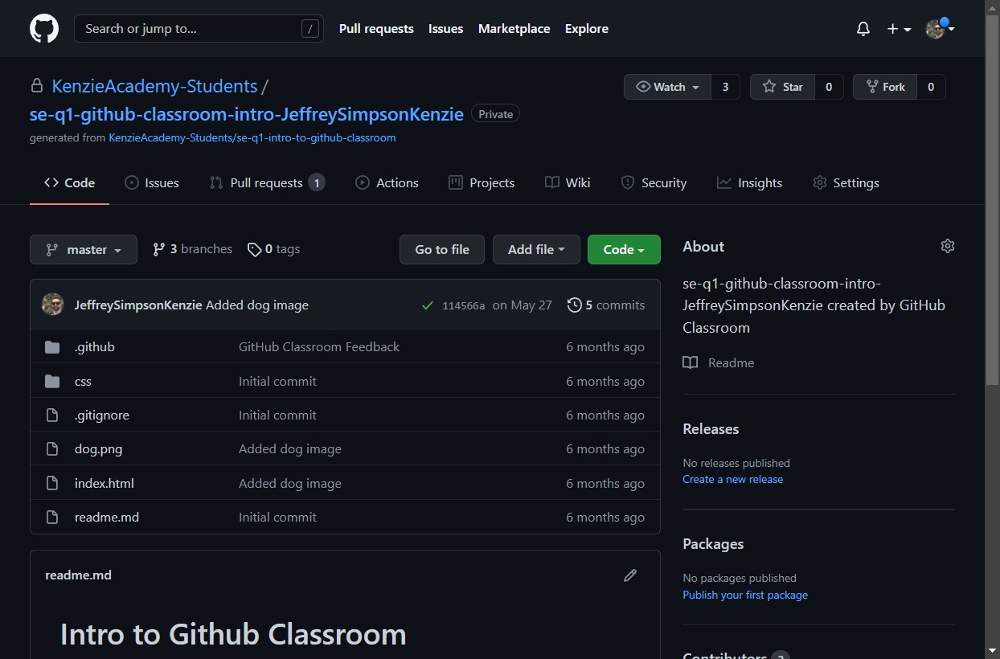
2. Click on **Settings** tab.
   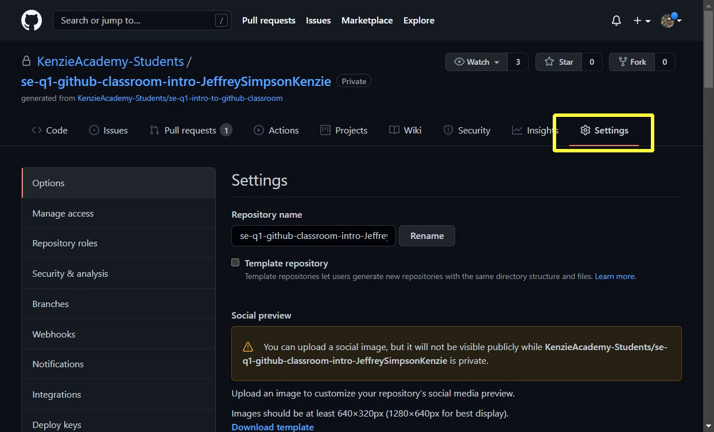
3. On the **Settings** tab, select **Manage Access** in the menu on the left.
   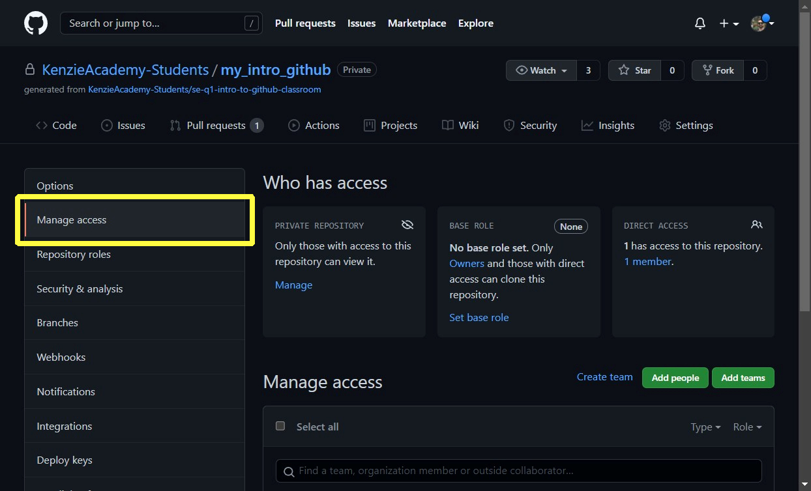
4. Click 'Manage' link in the **PRIVATE REPOSITORY** box.
   
5. Click the 'Change visibility' button inside the **Danger Zone** box.
   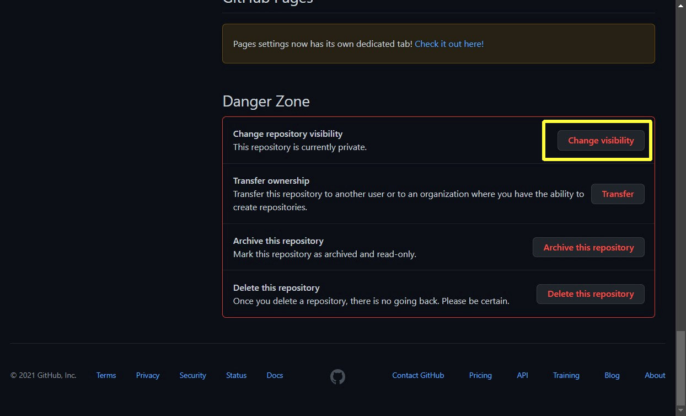
   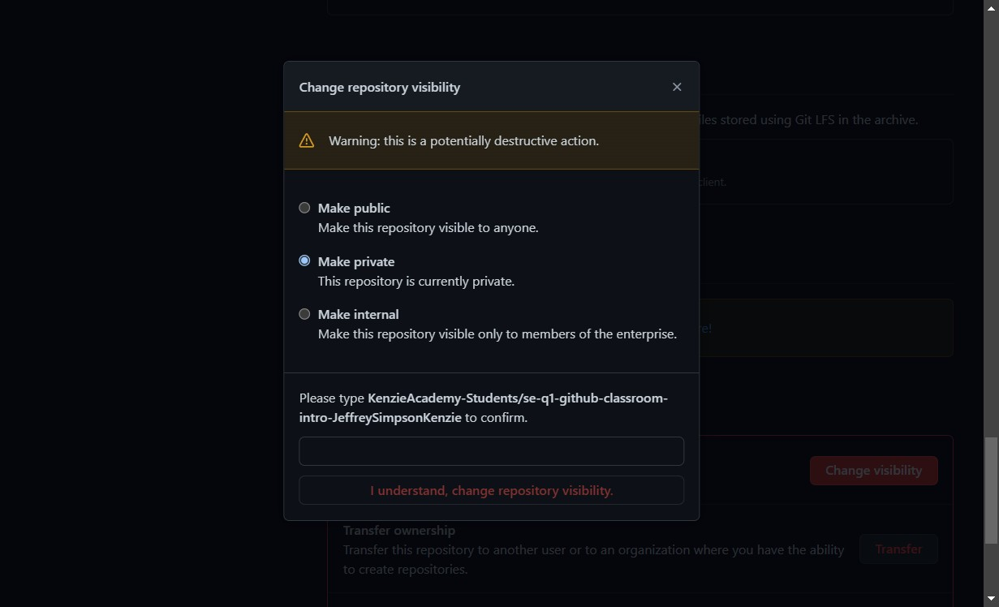
6. Select 'Public', type in the required text to submit the change.
   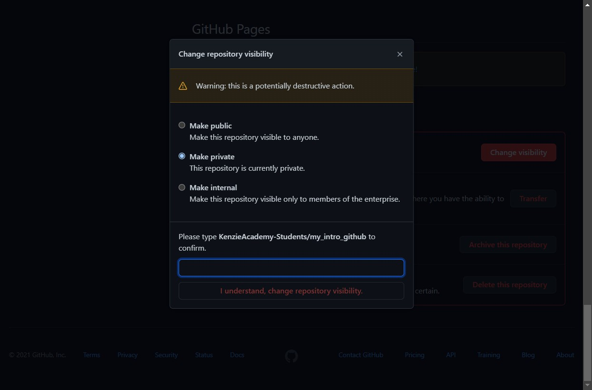
7. Refresh your page, then select the 'Fork' button.
   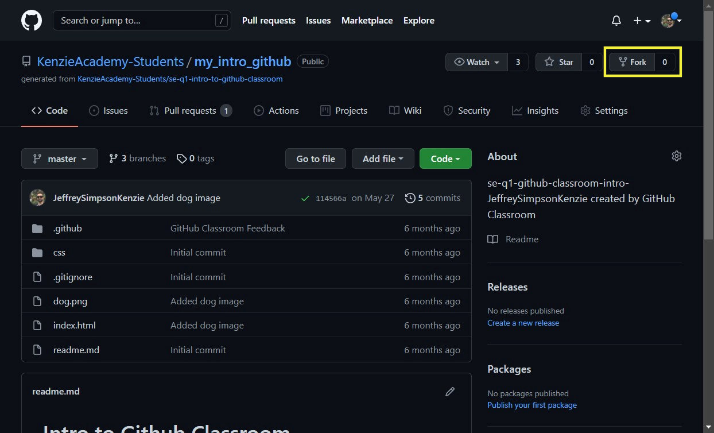
8. Choose the GitHub profile you want to fork your repo to.
   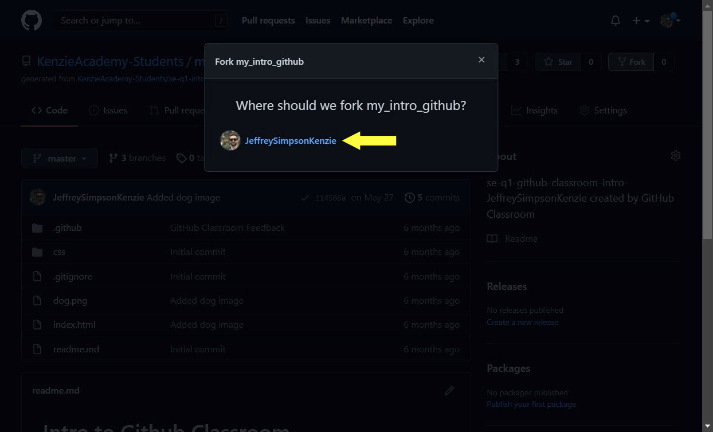
   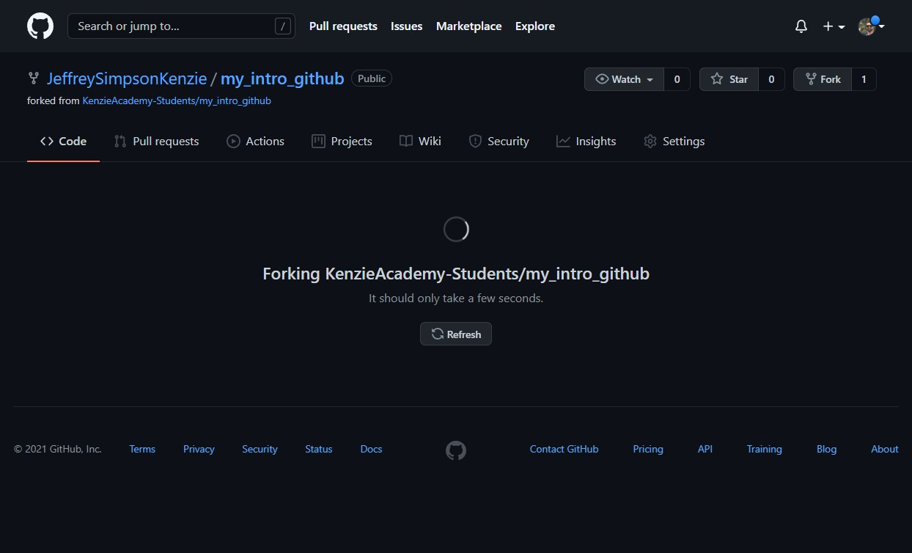
9. Go to the **Settings** tab.
   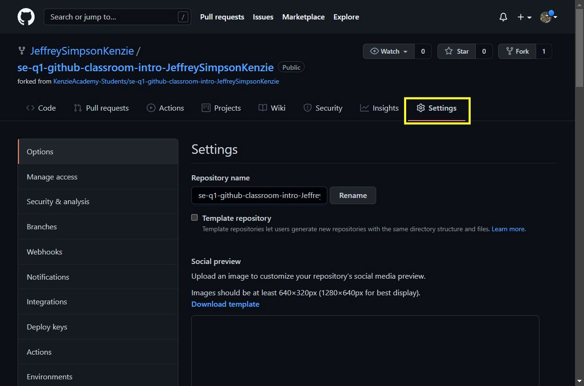

10. Rename the repo, without spaces, to a new title.
    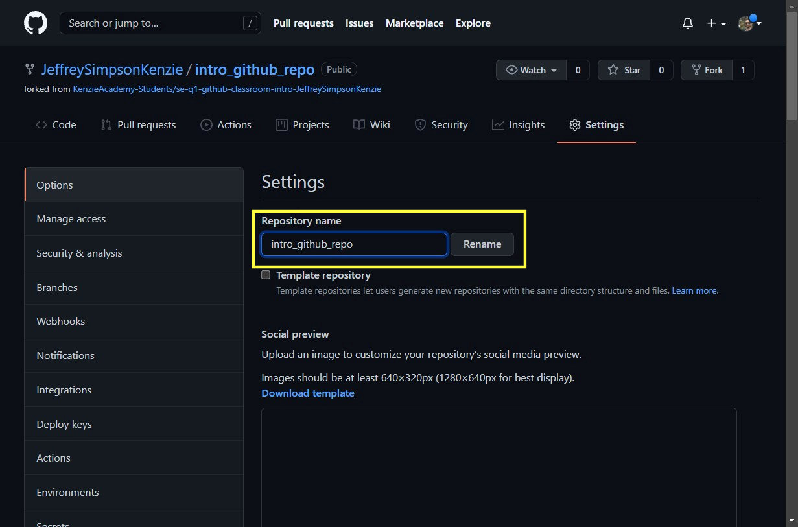

11. Return to your original Kenzie Classroom repo.
    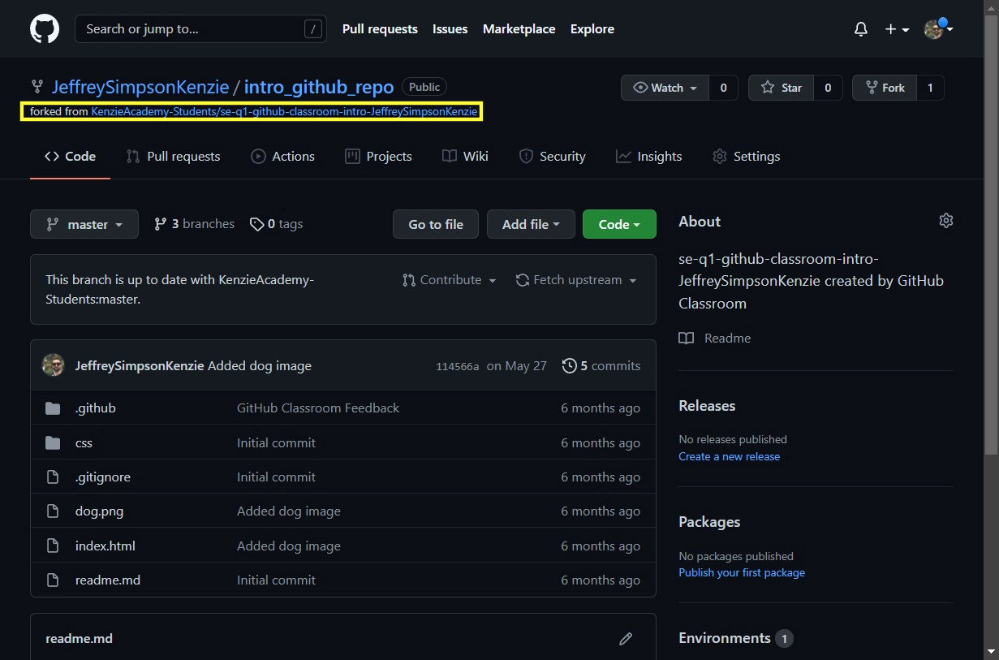
12. Set your Kenzie Classroom repo back to private.
    
    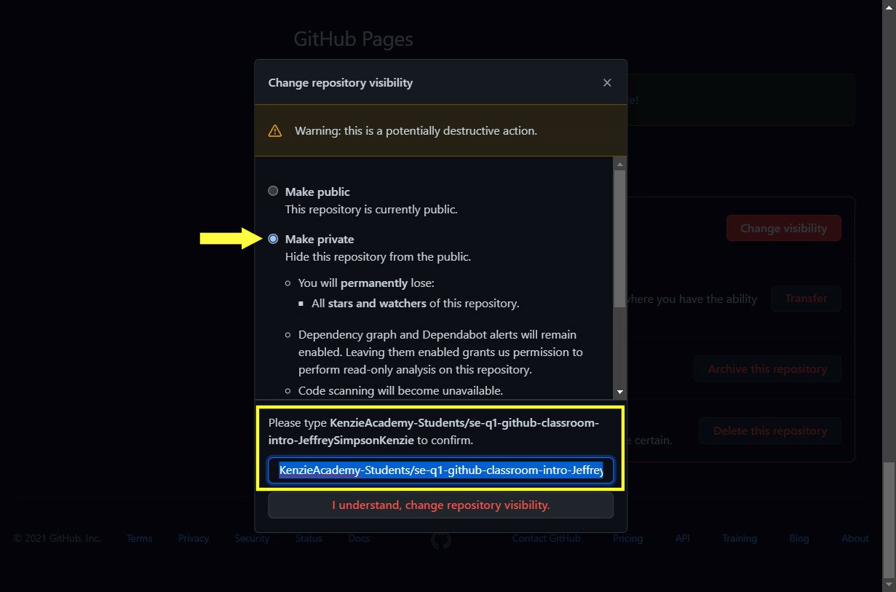
13. Your forked repo will appear on your GitHub profile.
    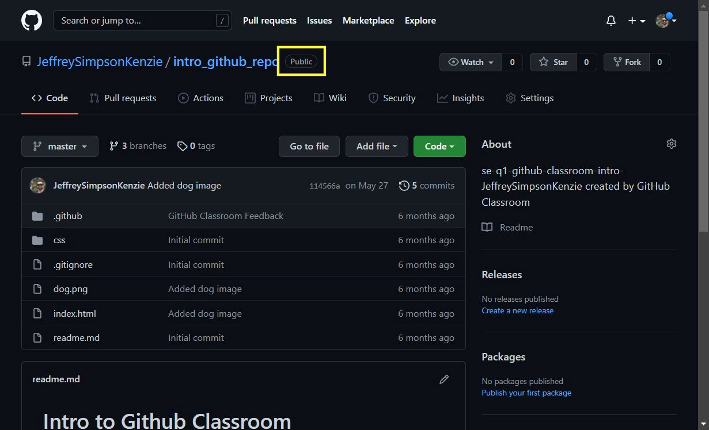
    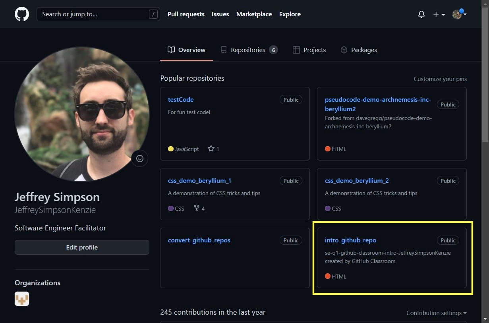
